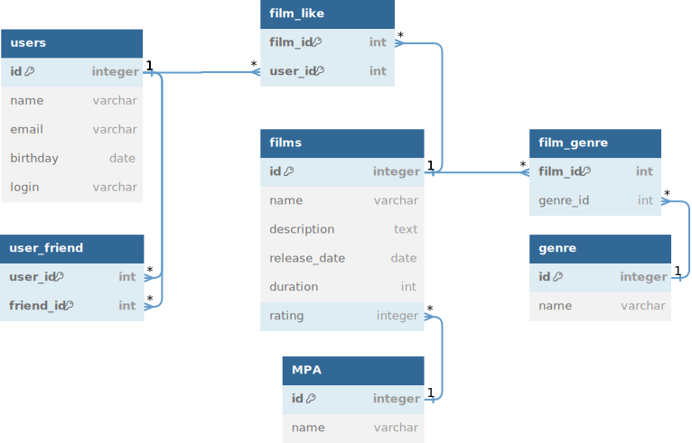

# КиноЛента
Бэкенд REST-сервиса, работающего с фильмами и оценками пользователей. Пользователи могут добавлять фильмы, ставить им оценки, добавлять других пользователей в друзья и получать списки фильмов, понравившихся своим друзьям.

## Дальнейшая разработка
### Перед тем как начать разработку, у вас должны быть установлены следующие зависимости:
- Java 11
- Apache Maven
### Сборка и запуск приложения
- Для сборки запустите из корня
  ```bash
  mvn package
- Для запуска запустите из корня
  ```bash
  java -jar target/filmorate-0.0.1-SNAPSHOT.jar
- Приложение запускается на порте 8080, поэтому если он занят нужно сначала завершить другое приложение, которое его занимает
- После запуска на хосте localhost:8080 будут доступны следующие эндпойнты:
  - GET:
    - /films - получить список всех фильмов
    - /films/{id} - получить фильм по его id
    - /films/popular[?count=10] - получить список популярных фильмов, count - количество фильмов в выдаче (необязательный параметр, по умолчанию равен 10)
    - /users - получить список всех пользователей
    - /users/{id} - получить пользователя по его id
    - /users/{id}/friends - получить список друзей пользователя по его id
    - /users/{id}/friends/common/{otherId} - получить список общих друзей с другим пользователем, {id} - id пользователя, {otherId} - id другого пользователя
    - /genres - получить список всех жанров
    - /genres/{id} - получить жанр по его id
    - /mpa - получить список всех возрастных рейтингов
    - /mpa/{id} - получить возрастной рейтинг по его id 
  - POST:
    - /films - создать новый фильм в базе, требуется тело запроса в JSON формате со структурой вида { name:, description:, releaseDate:, duration:, genres:, mpa:}, где name это обязательное поле названия фильма, description - необязательное описание максимальной длиной 200, releaseDate - дата выпуска (обязательное поле), duration - длительность в минутах (обязательное поле), genres список id жанров, mpa -  id возрастного рейтинга (обязательное поле)
    - /users - создать нового пользователя в базе, требуется тело запроса в JSON формате со структурой вида { name:, email:, birthday:, login:}, где name это имя пользователя (необязательное поле), email - электронная почта (обязательное поле), birthday - дата рождения (обязательное поле), login - логин (обязательное поле)
  - PUT:
    - /films - обновить информацию о фильме, требуется тело запроса в JSON формате со структурой аналогичной требуемой при создании фильма
    - /films/{id}/like/{userId} - поставить лайк фильму, {id} - id фильма, {userId} - id пользователя
    - /users - обновить информацию о пользователе, требуется тело запроса в JSON формате со структурой аналогичной требуемой при создании пользователя
    - /users/{id}/friends/{friendId} - добавить другого пользователя в друзья, {id} - id пользователя, {friendId} - id другого пользователя 
  - DELETE:
    - /films/{id} - удалить фильм по его id
    - /films/{id}/like/{userId} - удалить лайк, {id} - id фильма, {userId} - id пользователя
    - /users/{id}/friends/{friendId} - удалить другого пользователя из друзей, {id} - id пользователя, {friendId} - id другого пользователя
    - /users/{id} - удалить пользователя по его id

## Стек приложения: Java, SpringBoot, JDBC, JUnit, Maven.

## Хранение данных приложения организовано в памяти в БД H2.

## Схема базы данных приложения




### Примеры запросов к БД:

- Получение всех фильмов:
```sql
SELECT *
FROM films
```

- Получение всех фильмов с количеством лайков и жанрами:
```sql
SELECT f.id AS film_id,
f.name,
f.description,
f.duration,
f.release_date,
COUNT(l.user_id) AS likes_count,
g.name AS genre

FROM films AS f

LEFT JOIN film_like AS l ON f.id = l.film_id

LEFT JOIN film_genre AS fg ON f.id = fg.film_id
LEFT JOIN genre AS g ON fg.genre_id = g.id

GROUP BY f.id
```

- Получение 10 популярных фильмов:
```sql
SELECT f.id AS film_id,
f.name,
f.description,
f.duration,
f.release_date,

COUNT(l.user_id) AS likes_count

FROM films AS f
LEFT JOIN film_like AS l ON f.id = l.film_id


GROUP BY f.id
ORDER BY likes_count DESC
LIMIT 10
```

- Получение всех пользователей:
```sql
SELECT *
FROM users
```

- Получение друзей пользователя

```sql
SELECT u.id AS user_id,
u.name,
u.email,
u.login,
u.birthday

FROM users AS u
WHERE u.id IN (

SELECT uf.friend_id

FROM users
JOIN user_friend AS uf ON users.id = uf.user_id
WHERE users.id = 1)
```

- Получение общих друзей 2 пользователей

```sql
SELECT u.id AS user_id,
u.name,
u.email,
u.login,
u.birthday

FROM users AS u
WHERE u.id IN (

SELECT uf.friend_id

FROM users
JOIN user_friend AS uf ON users.id = uf.user_id
WHERE users.id = 1)
AND u.id IN (

SELECT uf.friend_id
FROM users
JOIN user_friend AS uf ON users.id = uf.user_id
WHERE users.id = 2)
```

