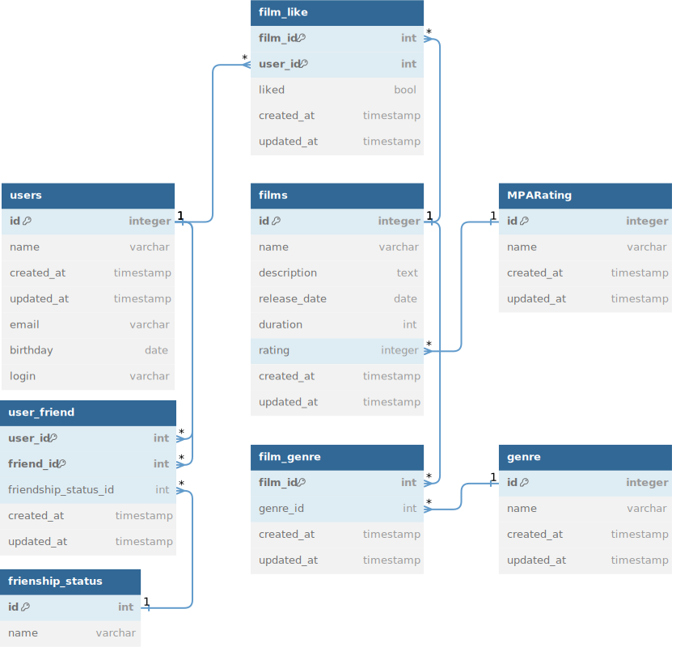

# java-filmorate
Template repository for Filmorate project.

## Схема базы данных приложения


### Примеры запросов к БД:

- Получение всех фильмов:
```sql
SELECT *
FROM films
```

- Получение всех фильмов с количеством лайков и жанрами:
```sql
SELECT f.id AS film_id,
f.name,
f.description,
f.duration,
f.release_date,
COUNT(l.user_id) AS likes_count,
g.name AS genre

FROM films AS f
LEFT JOIN likes AS l ON f.id = l.film_id
LEFT JOIN film_genre AS fg ON f.id = fg.film_id
LEFT JOIN genre AS g ON fg.genre_id = g.id

GROUP BY f.id
```

- Получение 10 популярных фильмов:
```sql
SELECT f.id AS film_id,
f.name,
f.description,
f.duration,
f.release_date,
COUNT(l.user_id) AS likes_count,

FROM films AS f
LEFT JOIN likes AS l ON f.id = l.film_id

GROUP BY f.id
ORDER BY likes_count DESC
LIMIT 10
```

- Получение всех пользователей:
```sql
SELECT *
FROM users
```

- Получение друзей пользователя

```sql
SELECT u.id AS user_id,
u.name,
u.email,
u.login,
u.birthday

FROM users AS u
WHERE u.id IN (
SELECT uf.id
FROM users
JOIN user_friend AS uf ON users.id = uf.user_id
WHERE users.id = 1)
```

- Получение общих друзей 2 пользователей

```sql
SELECT u.id AS user_id,
u.name,
u.email,
u.login,
u.birthday

FROM users AS u
WHERE u.id IN (
SELECT uf.id
FROM users
JOIN user_friend AS uf ON users.id = uf.user_id
WHERE users.id = 1)
AND u.id IN (
SELECT uf.id
FROM users
JOIN user_friend AS uf ON users.id = uf.user_id
WHERE users.id = 2)
```
